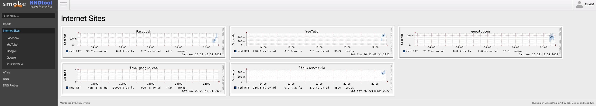

# AONOG2022-SMOKEPING Presentation


## Example


## Table of Conents
* [How to Use](#How-to-Use)


## How to Use

### Clone repository to your localhost

git clone https://github.com/schneto/AONOG2022-SMOKEPING.git


### Prepare the container
 ```
 less docker-compose.yml
  ```
 ```
---
version: "2.1"
services:
  smokeping:
    image: lscr.io/linuxserver/smokeping:latest
    container_name: aonog2022-smokeping
    environment:
      - PUID=1000
      - PGID=1000
      - TZ=Africa/Luanda
    volumes:
      - ./config/Targets:/config/Targets
      - ./config/Probes:/config/Probes
      - ./config/data:/config/data
      
    ports:
      - 80:80
    restart: unless-stopped
  ```

### Docker-compose pull smokeping image and build a container *aonog2022-smokeping*

 ```
 docker-compose up -d
  ```

### Navigate at the browser
 ```
http://localhost/smokeping/?
  ```

### Execute docker container

  ```
 docker exec -it aonog2022-smokeping bash
  ```

## Structure
Note: Edit Targets file in order to modify desired destinations
  ```
.
├── README.md
├── config
│   ├── Targets
│   ├── config
│   └── data
├── data
└── docker-compose.yml
  ```


### Docker-compose "stop" in order to preserve the container or "down" to remove container 

 ```
 docker-compose stop 

or

 docker-compose down
  ```

